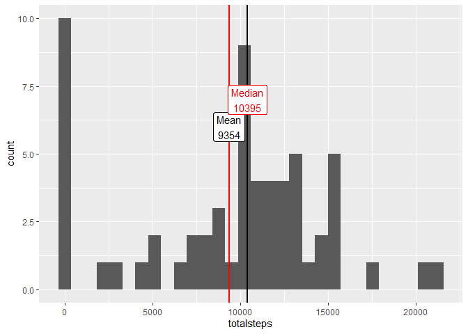
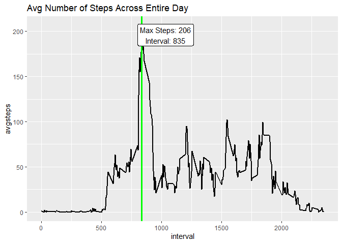
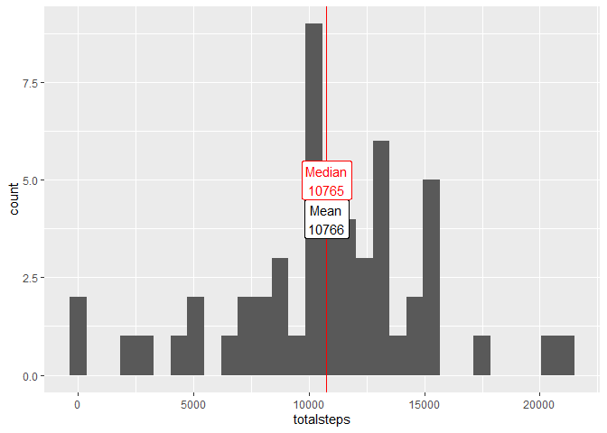
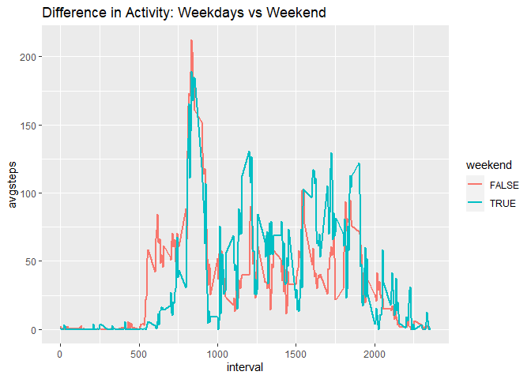

## Loading and preprocessing the data

```r
fileUrl <- "https://d396qusza40orc.cloudfront.net/repdata%2Fdata%2Factivity.zip"
download.file(fileUrl, destfile = "./activity.zip")
utils::unzip("./activity.zip") # activity.csv

# Loading and preprocessing the data
activity <- read.csv("./activity.csv")
activity$date <- as.Date(activity$date , format = "%Y-%M-%d")

library(lubridate)
# second month is november for some reason
nov_index <- which(activity$date == "2012-12-01")[which(activity$date == "2012-12-01") > 288][1]
month(activity$date[nov_index:length(activity$date)]) <- 11
```


## What is mean total number of steps taken per day?

```r
library(ggplot2); library(dplyr)
daily_steps <- activity %>% group_by(date) %>% summarise(totalsteps = sum(steps, na.rm = TRUE))
mean_totsteps <- mean(daily_steps$totalsteps)
med_totsteps <- median(daily_steps$totalsteps)

p2 <- ggplot(data = daily_steps, aes(x = totalsteps))
p2 + geom_histogram() + 
  geom_vline(aes(xintercept = median(totalsteps)), lwd = 1) +
  geom_vline(aes(xintercept = mean(totalsteps, na.rm = TRUE)), lwd = 1, col='red') + 
  geom_label(aes(x=mean_totsteps, label=paste0("Mean\n",round(mean_totsteps)), y= 6)) +
  geom_label(aes(x=med_totsteps, label=paste0("Median\n",round(med_totsteps)), y= 7), col='red') 
```

<!-- -->


## What is the average daily activity pattern?

```r
# What is the average daily activity pattern?
avgsteps_perinterval <- activity %>% group_by(interval) %>% summarise(avgsteps = mean(steps, na.rm = TRUE))
interval_max <- avgsteps_perinterval$interval[which.max(avgsteps_perinterval$avgsteps)]
avgsteps_max <- max(avgsteps_perinterval$avgsteps)
p3 <- ggplot(data = avgsteps_perinterval, aes(x = interval, y = avgsteps))
p3 + geom_line(lwd = 1) + 
  geom_vline(aes(xintercept = interval_max), lwd = 1.2, col = 'green') +
  geom_label(aes(x=interval_max + 200, 
                 label=paste0("Max Steps: ",round(avgsteps_max),"\nInterval: ",round(interval_max)), 
                 y= avgsteps_max - 10)) +
  labs(title = "Avg Number of Steps Across Entire Day")
```

<!-- -->


## Imputing missing values

```r
# Cleaning missing values

# see missing entries by day
dailymissing <- activity %>% group_by(date) %>% summarise(missingEntries = sum(is.na(steps)))
missingdays = dailymissing$date[which(dailymissing$missingEntries == 288)]

# remove missing days
cleaned_activity <- subset(activity, !(date %in% missingdays) )

daily_steps <- cleaned_activity %>% group_by(date) %>% summarise(totalsteps = sum(steps, na.rm = TRUE))
mean_totsteps <- mean(daily_steps$totalsteps)
med_totsteps <- median(daily_steps$totalsteps)
```


```r
p4 <- ggplot(data = daily_steps, aes(x = totalsteps))
p4 + geom_histogram() + 
  geom_vline(aes(xintercept = median(totalsteps)), lwd = .5) +
  geom_vline(aes(xintercept = mean(totalsteps, na.rm = TRUE)), lwd = .5, col = 'red') + 
  geom_label(aes(x=mean_totsteps, label=paste0("Mean\n",round(mean_totsteps)), y= 4)) +
  geom_label(aes(x=med_totsteps, label=paste0("Median\n",round(med_totsteps)), y= 5), col='red') 
```

<!-- -->

```r
# The mean changed after missing values were removed, which were in the previous hist as count 0.
```


```r
avgsteps_perinterval <- cleaned_activity %>% group_by(interval) %>% summarise(avgsteps = mean(steps, na.rm = TRUE))
interval_max <- avgsteps_perinterval$interval[which.max(avgsteps_perinterval$avgsteps)]
avgsteps_max <- max(avgsteps_perinterval$avgsteps)
p5 <- ggplot(data = avgsteps_perinterval, aes(x = interval, y = avgsteps))
p5 + geom_line(lwd = 1) + 
  geom_vline(aes(xintercept = interval_max), lwd = 1.2, col = 'green') +
  geom_label(aes(x=interval_max + 200, 
                 label=paste0("Max Steps: ",round(avgsteps_max),"\nInterval: ",round(interval_max)), 
                 y= avgsteps_max - 10)) +
  labs(title = "Avg Number of Steps Across Entire Day")
```

<!-- -->

```r
# the interval and its maximum did not change, as the NA values were ignored
# in the last time series plot
```


## Are there differences in activity patterns between weekdays and weekends?

```r
cleaned_activity$dayofweek <- as.POSIXlt(cleaned_activity$date)$wday

weekday_vs_weekend <- cleaned_activity %>% group_by(weekend = dayofweek %in% c(0,6), interval) %>%
  summarize(avgsteps = mean(steps))

p6 <- ggplot(weekday_vs_weekend, aes(x = interval, y = avgsteps, col = weekend))
p6 + geom_line(lwd = 1) + labs(title = "Difference in Activity: Weekdays vs Weekend")
```

<!-- -->
